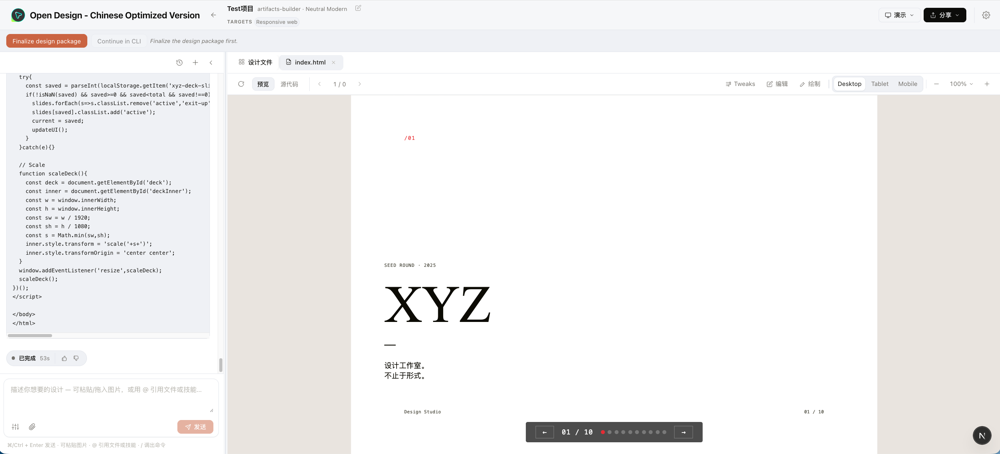
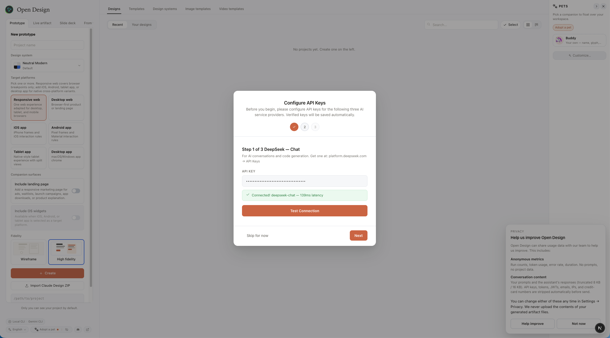
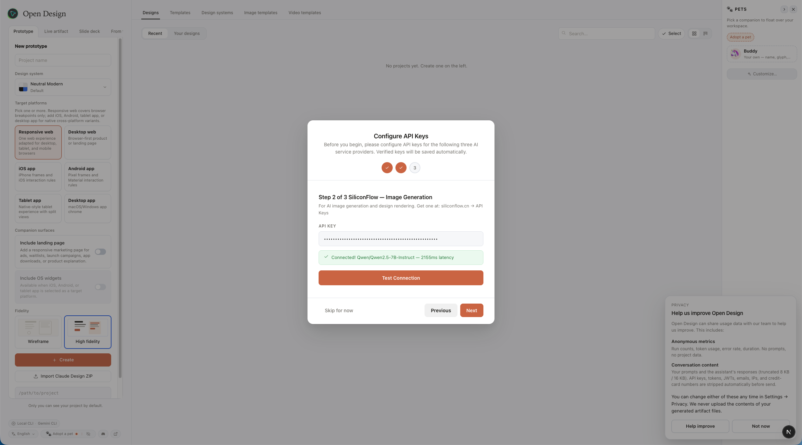
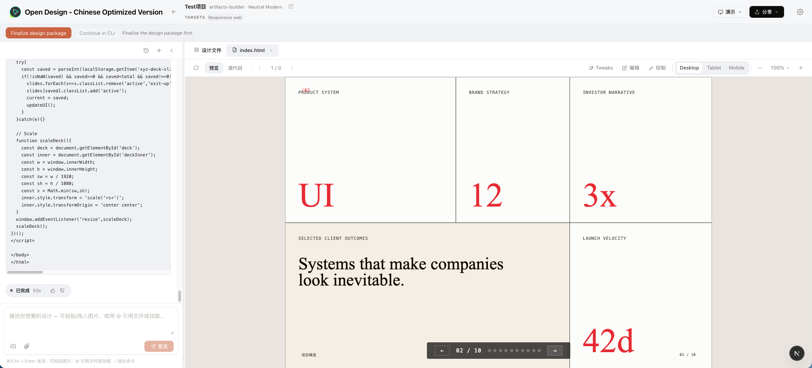

# Open Design - Chinese Optimized Version

这是基于 [nexu-io/open-design](https://github.com/nexu-io/open-design) 改造的中国优化版。上游项目提供了本地优先的 AI 设计生成框架：Web UI + 本地 daemon + Skills + Design Systems + Artifact 预览。本版本在此基础上，围绕中国大陆用户的实际使用环境做了易用性改造，让项目更容易启动、更容易接入国内可用模型，也更稳定地产出可预览的设计文件。

> 本仓库不是上游官方发布版，而是面向国内使用场景的本地化改造版本。原项目版权、许可证与上游贡献请参考 [nexu-io/open-design](https://github.com/nexu-io/open-design) 和 [LICENSE](LICENSE)。



## 这个版本改了什么

### 更适合中国网络环境的模型接入

- 默认以 API 模式启动，不强依赖本机已安装 Claude Code、Codex、Gemini CLI 等国外 CLI。
- 内置 DeepSeek 作为对话与代码生成入口，默认模型为 `deepseek-chat`，并支持 `deepseek-reasoner` 等模型选项。
- 内置 SiliconFlow 作为 OpenAI 兼容入口，默认模型为 `Qwen/Qwen2.5-7B-Instruct`，也提供 DeepSeek / Qwen 等常见模型选项。
- 首次启动提供 API Key 配置向导，可在界面内测试连通性，成功后保存到本地 `.od/app-config.json`。
- 保留上游 OpenAI-compatible / Anthropic-compatible 的扩展能力，方便继续接入 MiniMax、Ollama Cloud、Azure OpenAI、Google Gemini 等服务。

<p align="center">
  
  
</p>

### 更顺手的本地启动方式

- 新增 macOS 双击启动脚本 [start-open-design.command](start-open-design.command)，不需要记忆长命令。
- 新增停止脚本 [stop-open-design.command](stop-open-design.command)。
- 固定本地端口，减少“启动了但不知道打开哪个页面”的问题：
  - Web: `http://127.0.0.1:17573/`
  - Daemon: `http://127.0.0.1:17456`
- 启动脚本会自动检查 `node` / `pnpm`，缺少 `node_modules` 时会先执行 `pnpm install`。

### 更适合国内访问的前端与生成物

- 将部分生成物依赖从 `unpkg.com` 调整为 `unpkg.zhimg.com`，减少国内网络下 React / Babel CDN 加载失败。
- 生成界面尽量使用系统字体和本地资源，避免依赖容易被阻断的外部字体 CDN。
- 顶部品牌与本地运行提示调整为 `Open Design - Chinese Optimized Version`，降低使用者对“这是哪个版本”的困惑。

### 更稳定的设计文件生成与预览

- 修复模型只输出 fenced HTML 代码块时无法落盘、预览为空的问题。
- 修复 prototype 默认技能选择可能误选 validation-only 技能的问题。
- 增加 HTML artifact 结构校验，避免把模型总结文字当成 `.html` 文件保存。
- 针对高保真设计增加占位块拦截：最终产物不应出现黑/灰矩形、截图占位、头像占位、图表占位等空块。
- 已对当前示例 PPT 中的黑色占位块做清理，改为真实版面模块、产品系统板、品牌样张和趋势图。



## 快速开始

### 环境要求

- macOS 推荐，也可按上游方式在其他平台运行。
- Node.js `~24`，版本要求写在 [.node-version](.node-version)。
- pnpm `>=10.33.2 <11`，当前 [package.json](package.json) 使用 `pnpm@10.33.2`。

确认版本：

```bash
node -v
pnpm -v
```

### 方式一：双击启动

在 Finder 中双击：

```text
start-open-design.command
```

启动后打开：

```text
http://127.0.0.1:17573/
```

停止服务可双击：

```text
stop-open-design.command
```

### 方式二：命令行启动

```bash
pnpm install
pnpm tools-dev run web --daemon-port 17456 --web-port 17573
```

常用诊断命令：

```bash
pnpm tools-dev status
pnpm tools-dev logs
pnpm tools-dev check
pnpm tools-dev stop
```

## 首次配置 API Key

首次进入页面后，配置向导会引导填写两个国内优先入口：

| 步骤 | 用途 | 默认地址 | 默认模型 |
|---|---|---|---|
| DeepSeek | 对话、代码生成、设计 artifact 生成 | `https://api.deepseek.com/anthropic` | `deepseek-chat` |
| SiliconFlow | OpenAI-compatible 模型入口 | `https://api.siliconflow.cn/v1` | `Qwen/Qwen2.5-7B-Instruct` |

点击 `Test connection` 通过后再继续。配置会保存在本机 `.od/app-config.json`，不要把 `.od/` 或任何 API Key 提交到公开仓库。

如果暂时没有 Key，也可以跳过向导，稍后在设置中补充。

## 基本使用流程

1. 打开 `http://127.0.0.1:17573/`。
2. 选择 Prototype、Live artifact 或 Slide deck。
3. 填写项目名称，选择设计系统、目标平台和保真度。
4. 在输入框描述设计需求，例如“生成一个种子轮路演 PPT”或“做一个 SaaS 官网首屏”。
5. 等待左侧流式生成，右侧会出现设计文件和预览。
6. 生成完成后可继续修改、查看源码、分享或导出。

## 项目结构

| 路径 | 说明 |
|---|---|
| [apps/web](apps/web) | Next.js Web 前端，项目创建、聊天、文件预览、设置入口都在这里 |
| [apps/daemon](apps/daemon) | 本地 daemon，负责 API、模型调用、项目文件、SQLite 和 agent runtime |
| [packages/contracts](packages/contracts) | Web 与 daemon 共享的类型、提示词与协议定义 |
| [skills](skills) | 上游 Skills 体系，决定不同场景如何生成网页、PPT、移动端、报表等 |
| [design-systems](design-systems) | 可选设计系统与品牌风格素材 |
| [.od](.od) | 本地运行数据，包含项目文件、SQLite、配置；不要提交其中的密钥或私有生成物 |
| [start-open-design.command](start-open-design.command) | macOS 一键启动脚本 |
| [stop-open-design.command](stop-open-design.command) | macOS 一键停止脚本 |

## 与上游 Open Design 的关系

上游 [nexu-io/open-design](https://github.com/nexu-io/open-design) 的核心能力仍然保留：

- 本地优先的 Web + daemon 架构。
- Skills 驱动的设计生成流程。
- Design Systems 与 artifact-first 预览方式。
- 可接入本机 coding-agent CLI，也可使用 BYOK API 代理。
- 项目数据落在本地 `.od/`，生成文件可直接查看和编辑。

本版本的主要目标不是重写上游，而是让它在中国大陆更容易真正跑起来：默认国内模型、首启配置向导、本地一键脚本、国内 CDN 替换、中文化运行体验，以及对生成物落盘/预览质量的修复。

## 常见问题

### 打开 `127.0.0.1` 访问不了

不要只打开裸地址。默认 Web 端口是 `17573`，请访问：

```text
http://127.0.0.1:17573/
```

### `corepack` 不存在或 `pnpm` 找不到

先安装 pnpm：

```bash
npm install -g pnpm@10.33.2
```

然后重新运行 `start-open-design.command` 或命令行启动命令。

### API 测试失败

检查：

- Key 是否粘贴完整。
- 当前网络是否能访问 `api.deepseek.com` 或 `api.siliconflow.cn`。
- 账号是否有对应模型的调用权限与余额。
- 如果使用代理，确认代理没有拦截 SSE 流式响应。

### 生成了代码但右侧预览为空

当前版本已经增加 fenced HTML 恢复和 artifact 校验。如果仍然遇到，先运行：

```bash
pnpm tools-dev logs
```

再检查 `.od/projects/<project-id>/` 下是否生成了 `index.html`。

### 生成的 PPT 出现黑色方块

这通常是模型把缺失图片、截图或图表用视觉占位块代替。当前版本已经在提示词和 HTML 校验层禁止高保真最终稿保留此类占位块；如果是 wireframe 草稿则可允许占位块。

## 开发与验证

常用测试命令：

```bash
pnpm --dir apps/web exec vitest run -c vitest.config.ts tests/artifacts/validate.test.ts
pnpm --dir apps/web exec vitest run -c vitest.config.ts tests/artifacts/parser.test.ts
pnpm --dir apps/web exec vitest run -c vitest.config.ts tests/components/NewProjectPanel.test.tsx
```

类型检查：

```bash
pnpm typecheck
```

## 许可证

本项目沿用上游 Apache-2.0 许可证。请同时遵守上游项目、内置 Skills、Design Systems 和第三方素材各自的许可证与署名要求。
